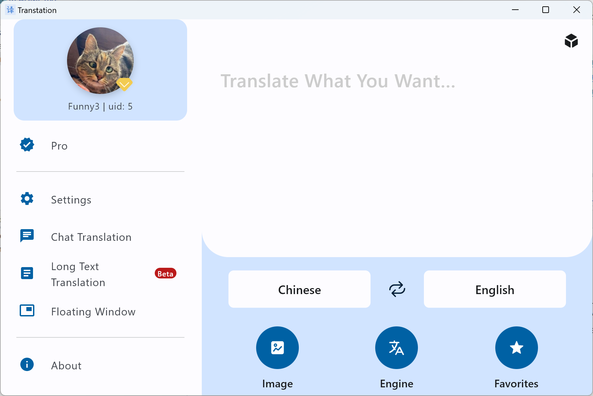
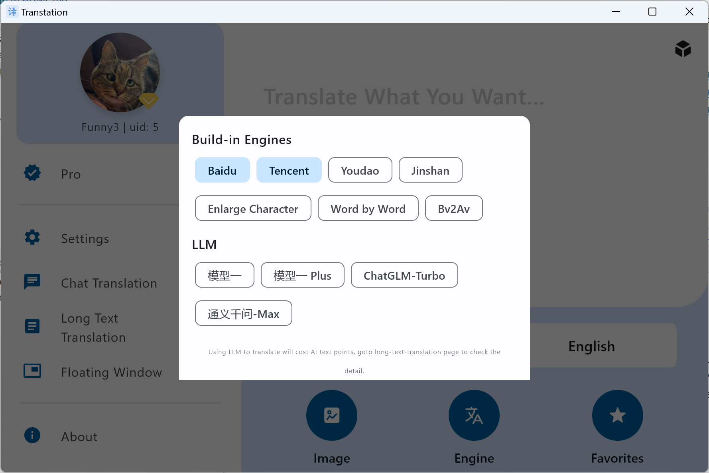
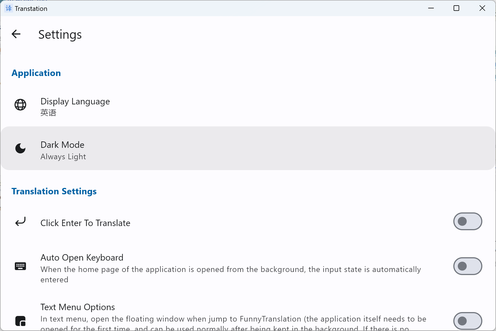
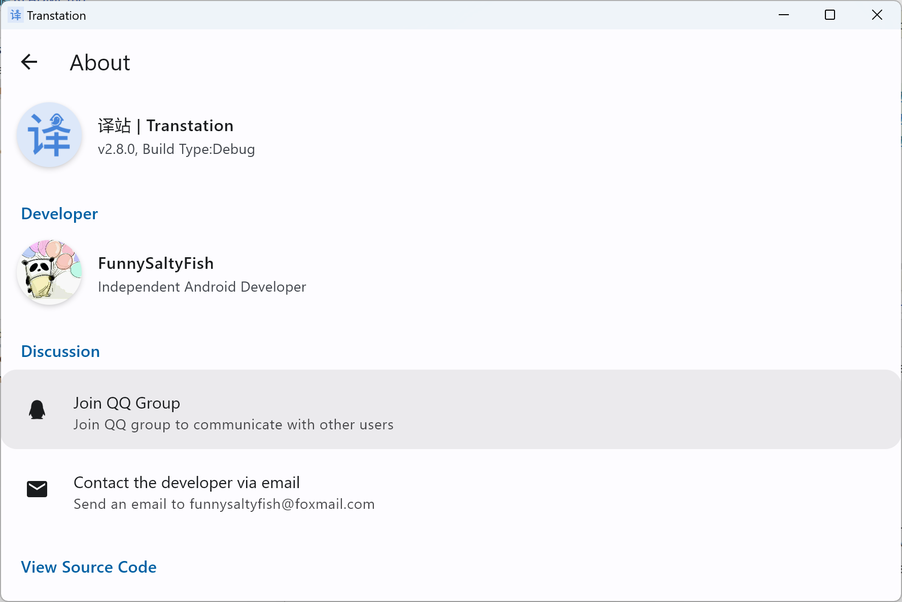
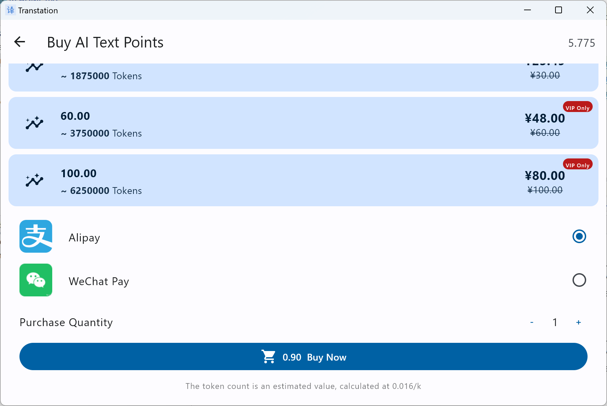
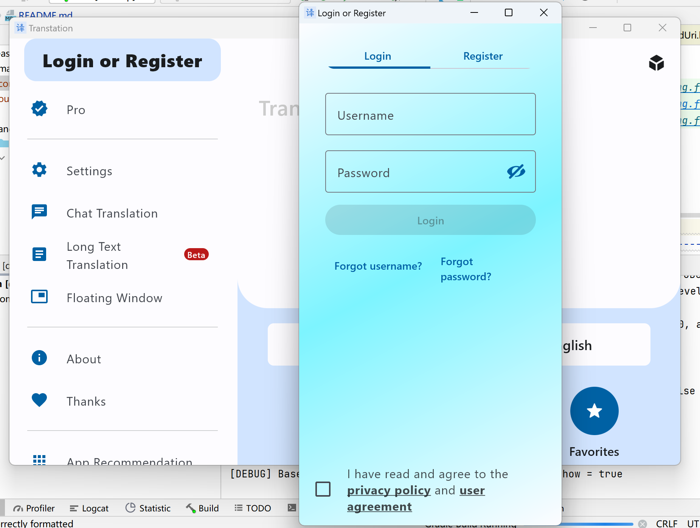

## Transtation
"Transtation" is the combination of "Translate" and "Station", it's an easy-to-use and powerful translation software for Android/Desktop(JVM), based on Kotlin Multiplatform + Compose Multiplatform. 

- Translate **one item using multiple engines** (Bing, Google, Baidu, Tencent) at the same time
- Use several advanced **Large Language Models** (LLMs), like ChatGPT, GPT-4, ChatGLM, Qwen to translate
- Or translate by chatting with LLMs
- You can even translate very long text in `Long Text Translation` page using LLMs
- Support plugin development, download, update, import, export, etc. with high scalability
- Image translation is also supported, several engines are available as well
- Screen translation is supported, floating window/regional screenshot translation/full-screen screenshot translation are all supported
- Customize your theme, language, engines, etc.
- ALL YOU NEED ABOUT TRANSLATION

> Due to the time limit, some of the features are not available in Desktop version yet, but they will be added in the future.

### Introduction

**This software is a translation software which mainly serves for Chinese users right now. It is also a open-source project which can be referred to when learning Jetpack Compose or Compose Multiplatform.** The project is the KMP version of [Transtation](https://github.com/FunnySaltyFish/FunnyTranslation), which has been maintained for 4 year in Android platform.

The following are the features of this application:

- Kotlin Multiplatform + Compose Multiplatform + MVVM + Kotlin Coroutine + Flow + SqlDelight
- Multi-module design, with separation between the common module and the project module
- Supports synchronized translation with multiple engines, and supports plugin development, download, update, import, export, etc. with high scalability
- Makes full use of the Kotlin language features, such as lazy loading, class proxy, Coroutine, Flow, sealed classes, extension methods, extension properties, and reflection, etc.
- Based on Rhino JS, it designs and implements a complete JavaScript plugin loading, running, and debugging environment, providing one-stop support for plugin development
- Adapts to Android11 file permissions, adapts to bilingual, dark mode, landscape/tablet pages, and develops, uses and publicly releases four open source libraries

The application gradually adapts to Android13, including:

- Supports setting the application language separately
- Supports Monet icon

You can get the latest version from the following ways ( Android + Windows):

  - [Official website(Chinese)](https://www.funnysaltyfish.fun/trans)
  - [Release Page](https://github.com/FunnySaltyFish/Transtation-KMP/releases)
  
Join [the QQ Group](https://qm.qq.com/q/64Ulp9Rjdm) to download the latest test version.

If you want to read the code, I recommend that you start from [the main Activity](/composeApp/src/androidMain/kotlin/com/funny/translation/translate/TransActivity.android.kt) or [AppNavigation](/composeApp/src/commonMain/kotlin/com/funny/translation/translate/AppNavigation.kt)

If you find it helpful, **welcome to star**!

### Screenshot

#### Screen Recording
> v2.8.0 (2024/01/15)

https://github.com/FunnySaltyFish/Transtation-KMP/assets/46063434/ded5d1c6-553c-4f45-96a4-74d870fcbcb8


#### Running Screenshot

##### Android

UI v4：
|          |          |          |
| -------- | -------- | -------- |
|  |  |  |
|  |  |  |
|  |  |          |


<details>
<summary>Old UI v3</summary>

| Screenshot                                                 | Screenshot                                                 |
|------------------------------------------------------------|------------------------------------------------------------|
|  |  |
|  |  |
</details>

##### Desktop
* Desktop version is still under development, the UI might change a lot in the future.


| Screenshot                                                         | Screenshot                                                         |
|--------------------------------------------------------------------|--------------------------------------------------------------------|
|  |  |
|  |  |
|  |  |

### For Developers

If you're a developer and want to view the code or build the application, the following might be helpful:

#### IDE Experience

In the initial days of development, I tried using Fleet, Android Studio, and IDEA multiple times to develop this application. In the end, I continued using Android Studio. Its development experience is essentially consistent with IDEA, and Desktop applications can be run directly by clicking a small button. The reasons for not choosing the other two are:

- Fleet: Currently, it seems a bit rudimentary, and it's challenging to bring up various windows (cannot be kept resident), lacks AI completion.
- IDEA: The automatically generated expect/actual positions are very strange. For example, on the Android side, it displays both `androidMain` and `kotlin.androidMain`. Choosing the former has no effect, and choosing the latter generates a file with a name like: `Xxx.android.commonMain.kotlin.kt`, which is not very reasonable.

#### Migration Process
I recorded some of the migration process, I suggest you read it if you're interested in it. Because it is too long, I put it to another file:
- [English file here](migration_process.md)
- [中文版博客](https://juejin.cn/post/7324384083428835367)

#### Source Code Overview

As an open-source project, you can learn about it from the following aspects:

##### Code Style
In terms of code organization, the code here doesn't strictly follow Google's best practices. If you want to pursue elegant code, you can refer to Google's official [NowInAndroid project](https://github.com/android/nowinandroid). However, in terms of actual usage, that project's pursuit of unified data flow has led to suboptimal user experience (for example, in the version I experienced, clicking on "Favorite" in any list item would trigger an upstream flow update, refreshing the entire list. This would cause the list to scroll back to the top when you click a favorite button, which clearly doesn't align with the actual user experience).

The code is written following this rule: Composable + ViewModel. Simple logic is implemented directly in Composable, while more complex logic is implemented in ViewModel. For the sake of convenience, the State inside the ViewModel has not adopted the "internal MutableState + externally exposed State" strategy. Instead, all States are mutable, and some are directly accessed through `vm.xxx`.

However, there are still some basic cleanliness aspects, such as naming conventions, code indentation, and Kotlin-style programming. The main ViewModel files and Composable pages, under AS inspection, achieve full green for the most part, with the majority of yellow Lint warnings ranging from 1 to 5, mostly relating to unused TAG variables or unused functions.

##### Modules

- **composeApp: the main translation page**
- **base-kmp: the basic module, defining basic Beans, and introducing third-party modules in API form for use by other parts**
- **code-editor: the code editor page**
- **login: the login and registration page**
- **ai: LLM related logics**
- android-code-editor: editor, language-base, language-universal: code editor View from the open-source project [sora-editor](https://github.com/Rosemoe/sora-editor)  
- ~~buildSrc: dependency version management~~

##### Preparation Before Running

- You need to use [Android Studio](https://developer.android.com/studio/) version **Flamingo or higher**, the **newest stable version** is highly recommended.

- For security reasons, the open-source part does not include the `signing.properties` file containing signature information. If you need to build a release version, please add this file yourself.

    - **signing.properties**

    - located in the root directory

      ```bash
      // If you need to build a release package, please add this file yourself in the project root directory
      /**
       *  STORE_FILE=yourAppStroe.keystore
          STORE_PASSWORD=yourStorePwd
          KEY_ALIAS=yourKeyAlias
          KEY_PASSWORD=yourAliasPwd
       */
      ```
      
- For Chinese developers, due to the preferred repositories are Google and Maven, you may need to configure the proxy to download the dependencies. Or you can modify the `repositories` in `build.gradle.kts` and `settings.gradle.kts` and move the Chinese mirrors to the top. 

If you are unable to run it on the latest stable version of Android Studio and the correct Gradle version, and you have confirmed that it is not due to your own issues, feel free to open an issue and ask. It's possible that I missed some files when committing to Git. I will respond as soon as I see it.

### Acknowledgments

- UI design (v3) referenced from 酷安@江戸川コナン (authorized)
- UI design (V4) and promotional graphics from 酷安@松川吖
- Thank you to all the friends who have sponsored the project!
- Thank you to all the contributors!


### Contributors ✨

<a href="https://github.com/FunnySaltyFish/Transtation-KMP/graphs/contributors">
  
</a>


### Star History

<a href="https://star-history.com/#FunnySaltyFish/Transtation-KMP&Date">
 <picture>
   <source media="(prefers-color-scheme: dark)" srcset="https://api.star-history.com/svg?repos=FunnySaltyFish/Transtation-KMP&type=Date&theme=dark" />
   <source media="(prefers-color-scheme: light)" srcset="https://api.star-history.com/svg?repos=FunnySaltyFish/Transtation-KMP&type=Date" />
   
 </picture>
</a>

If this project is helpful to you, welcome to **Star** it~
