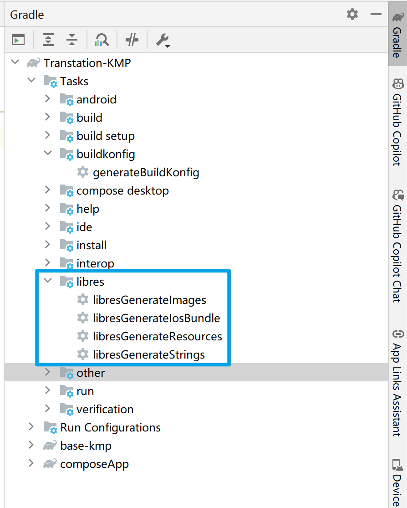
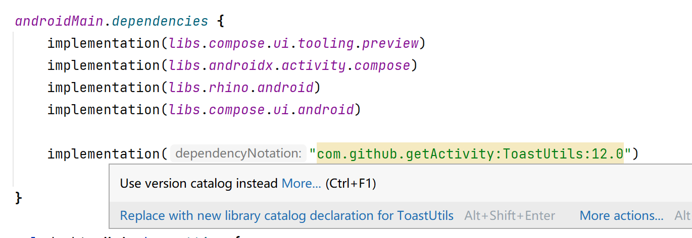
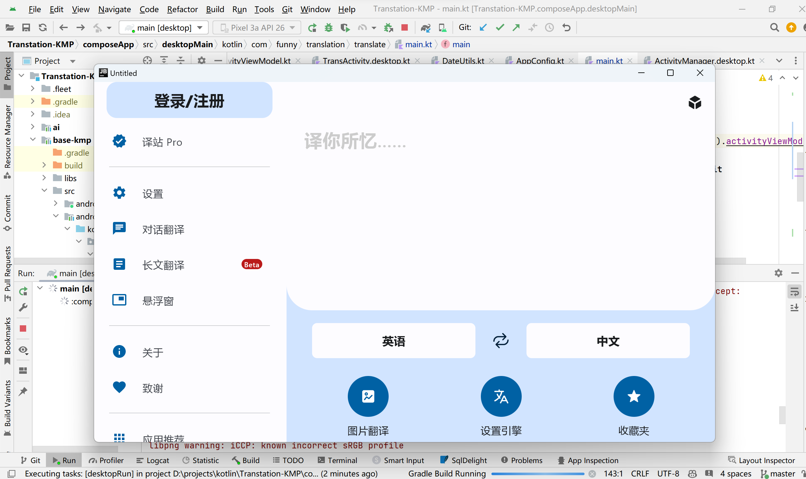
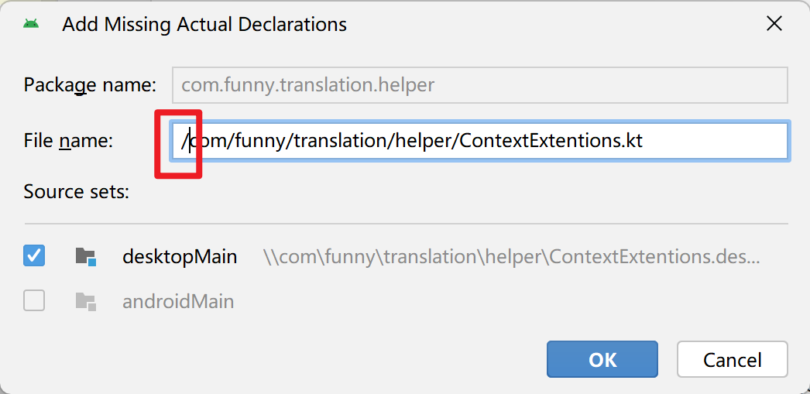
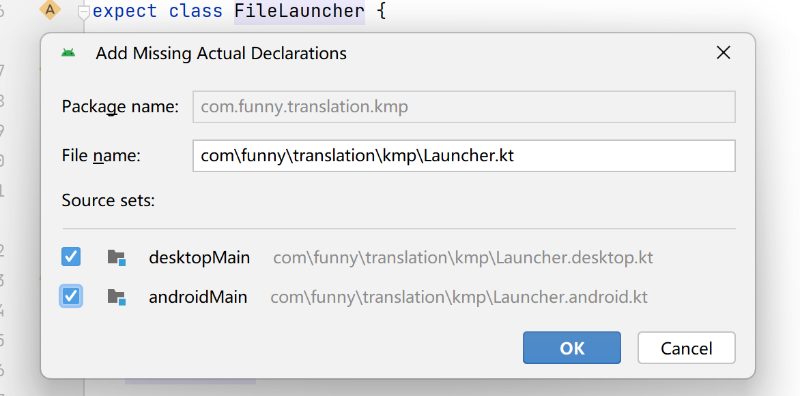
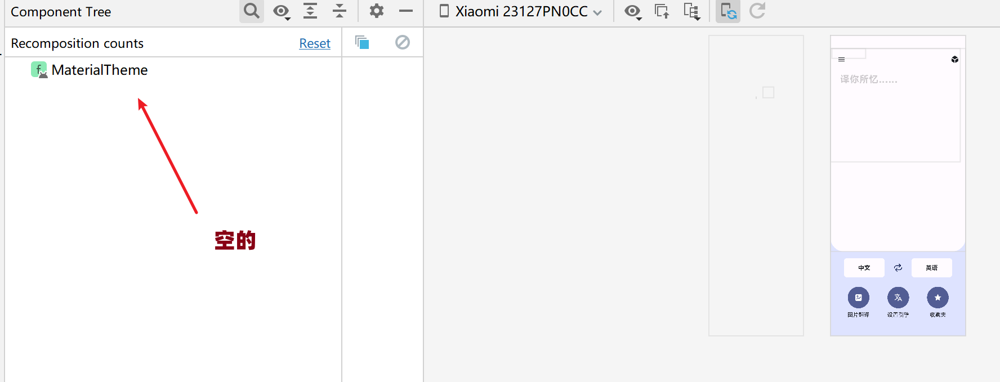
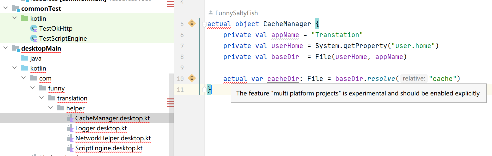
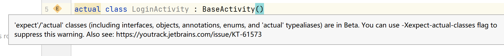

## Migration Process

### Before Migration

As the entire project was involved in the migration to KMP + CMP, I had to be cautious. Before officially starting the migration, I spent some time preparing.

#### Considering Migration Conditions

For the project to migrate to KMP + CMP, it might come with some inherent advantages:

- Almost all UI is implemented using Jetpack Compose and can be migrated.
  - However, floating windows and code editors use XML.
  - Some controls are also Views, such as WebView and MarkdownText.

- Some third-party libraries used are inherently cross-platform.
  - JSON serialization framework uses kotlinx.serialization, which is cross-platform.
  - kotlinx.coroutines is cross-platform.
  - LiveData is not used at all; everything is changed to Flow, making it cross-platform.

- The codebase is mostly written in Kotlin.
- The target platforms are Desktop (JVM) and Android, both having a Java runtime environment. This means `commonMain` can use Java APIs like `java.io.File`, `java.util.Date`, resulting in minimal code changes.

However, there are still many challenges. As an Android project, a significant amount of code involves Android-specific APIs like `Context` and `Activity`. After reviewing the code and the GitHub repository, I attempted to list potential changes before the migration.

#### Possible Changes

Based on the current code and potential changes listed in the KMP project README, I identified the following major changes:

##### Primary Changes

| Component            | Original Android Version                                     | KMP                                                          | Potential Issues                                             |
| -------------------- | ------------------------------------------------------------ | ------------------------------------------------------------ | ------------------------------------------------------------ |
| Database             | androidx.room                                                | [cashapp/sqldelight: SQLDelight - Generates typesafe Kotlin APIs from SQL (github.com)](https://github.com/cashapp/sqldelight) | Significant changes in syntax, requiring the creation of sq files and manual SQL statement writing. |
| Resources            | XML, res folder, `stringResource()`, `painterResource()`, `string()` (custom global function), `context.getString()`, `resources.getString()`, BitmapFactory-related classes | ~~[icerockdev/moko-resources: Resources access for mobile (android & ios) Kotlin Multiplatform development (github.com)](https://github.com/icerockdev/moko-resources)~~<br />The above does not work on Desktop.<br />[Skeptick/libres: Resources generation in Kotlin Multiplatform (github.com)](https://github.com/Skeptick/libres) | Changes needed in various syntax, replacing R with MR, reimplementation of `string()` function, and replacement of context and resources references.<br /><br />Cross-platform image and resource access are provided: [Compose Multiplatform](https://www.jetbrains.com/help/kotlin-multiplatform-dev/compose-images-resources.html#access-images) |
| JavaScript Execution | rhino-android                                                | rhino?<br />[icerockdev/moko-javascript: JavaScript evaluation from kotlin common code for android & iOS (github.com)](https://github.com/icerockdev/moko-javascript?tab=readme-ov-file)？ | Actual/expect work needed; check if rhino can still be used on the JVM platform. |
| Navigation           | androidx.navigation                                          | [Tlaster/PreCompose: Compose Multiplatform Navigation && State Management (github.com)](https://github.com/Tlaster/PreCompose) |                                                              |
| ViewModel            | androidx.lifecycle                                           | [Tlaster/PreCompose: Compose Multiplatform Navigation && State Management (github.com)](https://github.com/Tlaster/PreCompose) |                                                              |
| Persistence          | MMKV + ComposeDataSaver                                      |                                                              | MMKV should be cross-platform, but ComposeDataSaver needs modification to be cross-platform. |
| Network Requests     | OkHttp + Retrofit                                            |                                                              | Likely to work on the JVM platform.                          |
| Permissions          | Permission                                                   |                                                              | The concept of permissions is not present on the JVM platform. |


##### Miscellaneous

- Toast
- Log (currently all logs are using android.Log)
- Handler
- Various Context-related functionalities
- File reading
- Broadcasts (network state determination), Service
- Intent (launching Activity, Service, etc.)
- Activity – there are still a few Activities, which also need to be handled as platform-specific
- Caching (context.cacheDir/externalCacheDir)
- Locale-related functionalities
- Files in Assets
- Image selection, file selection
- Image loading (Coil is in the process of supporting cross-platform, but currently does not support): [qdsfdhvh/compose-imageloader: Compose Image library for Kotlin Multiplatform.](https://github.com/qdsfdhvh/compose-imageloader)
- BuildConfig: [yshrsmz/BuildKonfig: BuildConfig for Kotlin Multiplatform Project (github.com)](https://github.com/yshrsmz/BuildKonfig)

Later, I found that the official documentation also provides a list of Android-specific APIs: [Android-only components | Kotlin Multiplatform Development Documentation](https://www.jetbrains.com/help/kotlin-multiplatform-dev/compose-android-only-components.html#api-without-android-classes-in-their-signatures), which can serve as a reference for potential obstacles during migration.

### Actual Process

I decided to create a completely new project and gradually complete the migration by copying code, compiling, and running step by step. I started the new project using

#### Initial Two to Three Days (December 23, 2023 - December 15, 2023)

- In the initial two to three days, I was constantly trying to configure "reusable build scripts," but I kept encountering failures, causing quite a headache.
- The main reference projects were [Shabinder/SpotiFlyer: Kotlin Multiplatform Music Downloader, Supports Spotify / Gaana / Youtube Music / Jio Saavn / SoundCloud](https://github.com/Shabinder/SpotiFlyer), and I also consulted the official documentation [Sharing build logic in a multi-repo setup Sample (gradle.org)](https://docs.gradle.org/current/samples/sample_publishing_convention_plugins.html).
- During the process, I encountered changes in the syntax of Gradle plugin writing. The new version recommends using the `id` to apply the plugin, which can be found on the Gradle Plugin Search: https://plugins.gradle.org/search.
- Unfortunately, I wasn't successful in the end.


Continuing from where you left off:

#### December 26th

On the 26th, I decided to abandon attempts to configure build scripts and, for now, use the copy-paste method. I started practical code running experiments and successfully completed running JavaScript on both Android and Desktop platforms.

#### December 27-28

During these two days, I primarily focused on making `OkHttp` + `Retrofit` run on both platforms. Due to the extensive nature of the original code, even for network requests, it involved multiple files. In this process, I also addressed `Json` serialization, `CacheManager` (managing items like `appContext.externalDir` uniformly), and set up a basic test environment.

#### December 29th

I began validating resource migration. After trying moko-resources for half a day, I found it couldn't correctly generate corresponding artifacts on the Desktop platform. Similar issues in the issues list were unresolved. Therefore, I switched to using `libres`.

`Libres` can run successfully on both platforms, meaning string resources are now accessible. It requires writing `strings_en.xml` and `strings_zh.xml` in a specific directory, configuring entries through `<string name="xxx">XXX</string>`, and then generating the Kotlin `ResStrings` class by running a `gradle` task. This implies a considerable amount of code needs modification (previously accessed through `R.string.xxx`).

Additionally, during runtime, I found that Libres prohibits the use of Java-style format. For example, a format like:

```xml
<string name="tip_reset_fingerprint">The fingerprint information saved for the current account (%1$s) on this device seems to have been cleared. Would you like to re-add the fingerprint and send a verification code to verify your email (%2$s)?</string>
```

needs to be changed to:

```xml
<string name="tip_reset_fingerprint">The fingerprint information saved for the current account ${username} on this device seems to have been cleared. Would you like to re-add the fingerprint and send a verification code to verify your email ${email}?</string>
```

In the Gradle task for libres, you can find the corresponding task to generate:



Libres generates corresponding code like:

```kotlin
// StringsEn.kt
public object StringsEn : Strings {
    override val hint: String = "Hint"

    override val tip_reset_fingerprint: LibresFormatTipResetFingerprint =
      LibresFormatTipResetFingerprint("The fingerprint information saved for the current account %1${'$'}s on this device seems to have been cleared. Would you like to re-add the fingerprint and send a verification code to verify your email %2${'$'}s?")
    
}

// FormattedClasses.kt
public class LibresFormatTipResetFingerprint(
  private val `value`: String,
) {
  public fun format(username: String, email: String): String = formatString(value,
      arrayOf(username,email))
}
```

When calling, you manually use `.format()`.

The next step is to replace all occurrences of `R.string.xxx`. In my project, they mostly take the following forms:

```kotlin
context.getString(R.string.xxx) 
string(R.string.xxx) // global function, inside calls a similar method of applicationCtx
stringResources(R.string.xxx) // Jetpack Compose method to get a string

// and those with parameters
string\(R.string.([^,]+),\W(.+)\)
```

The above are easy to replace, relying on regular expressions in AS:

```regex
// with parameters
string\(R.string.([^,]+),\W(.+)\) -> ResStrings.$1.format($2) (This replacement may need manual adjustment, adding .toString() for non-String parameters)

// without parameters
string\(R.string.(\w+)\) -> ResStrings.$1
stringResource\(R.string.(\w+)\) -> ResStrings.$1
stringResource\(id = R.string.(\w+)\) -> ResStrings.$1
```

However, there are some that are not easy to replace, like those inside a class referencing resource IDs, e.g., `class Student(val nameId: Int)`. Now, this has to be migrated step by step.


Continuing from where you left off:

#### December 31st

On the last day of 2023, I found myself still toiling away at the migration. On this day, I focused on migrating the database from Room to SQLDelight.

Referring to [Getting Started - SQLDelight](https://cashapp.github.io/sqldelight/2.0.1/multiplatform_sqlite/), I completed the setup and used [SQLDelight 使用笔记 - 掘金 (juejin.cn)](https://juejin.cn/post/7287218567090847799) as a Chinese reference. It's important to note that, although both the official documentation and the reference suggest placing `sq` in the `main` folder, I had to place it in the `commonMain` folder; otherwise, no code was generated.

The table name you choose determines the generated `data class` name. I had named it `trans_history`, resulting in a class named `class Trans_history`. Changing it to `create table transHistory` corrected the issue. The SQLDelight plugin proved to be quite handy. After installing the plugin with the same name in AS, any changes made in a single `sq` file immediately generated the corresponding code, without the need for manual building (manual execution of Gradle tasks is only required when modifying the Database, such as creating a new Table or adding Queries).

While writing, I noticed that all `Integer`-typed fields written in `sql` generate class properties defaulting to `Long`, whereas I had originally defined them as `Int`. To resolve this, you need to manually specify it using `AS`:

```sql
import kotlin.Boolean;

CREATE TABLE foo(
  is_bar INTEGER AS Boolean
);
```

Similar adjustments are required for converting `Text` to something like `List<Int>`. You need to pass in `ColumnAdapter` when defining the Database (the parameter list is also autogenerated), like this:

```kotlin
val listOfStringsAdapter = object : ColumnAdapter<List<String>, String> {
  override fun decode(databaseValue: String) =
    if (databaseValue.isEmpty()) {
      listOf()
    } else {
      databaseValue.split(",")
    }
  override fun encode(value: List<String>) = value.joinToString(separator = ",")
}

val queryWrapper: Database = Database(
  driver = driver,
  hockeyPlayerAdapter = hockeyPlayer.Adapter(
    cup_winsAdapter = listOfStringsAdapter
  )
)
```

How to convert the previously written `TypeConverter`? Let me assist you with that:

> I'm currently migrating my Android app to KMP, switching from Room to SqlDelight for the database. Refer to the following code snippets to convert all room type converters to the format required by sqldelight:
>
> Reference code:
>
> ```kotlin
> val listOfStringsAdapter = object : ColumnAdapter<List<String>, String> {
> override fun decode(databaseValue: String) =
>  if (databaseValue.isEmpty()) {
>    listOf()
>  } else {
>    databaseValue.split(",")
>  }
> override fun encode(value: List<String>) = value.joinToString(separator = ",")
> }
> ```
>
> The code you need to convert:
>
> ```kotlin
> class LanguageListConverter{
>  @TypeConverter
>  fun languagesToJson(languages : List<Language>) : String = JsonX.toJson(languages)
> 
>  @TypeConverter
>  fun jsonToLanguages(json : String) : List<Language> {
>      return JsonX.fromJson(json)
>  }
> }
> 
> // .... and so on
> ```
> Your generated code will be a singleton object, and JsonX is an existing implementation, no need to change.

For basic types, you can use their provided sibling module:

> ## Primitives[¶](https://cashapp.github.io/sqldelight/2.0.1/multiplatform_sqlite/types/#primitives)
>
> A sibling module that adapts primitives for your convenience.
>
> ```kotlin
> dependencies {
> 	implementation("app.cash.sqldelight:primitive-adapters:2.0.1")
> }
> ```
>
> The following adapters exist:
>
> - `FloatColumnAdapter` — Retrieves `kotlin.Float` for an SQL type implicitly stored as `kotlin.Double`
> - `IntColumnAdapter` — Retrieves `kotlin.Int` for an SQL type implicitly stored as `kotlin.Long`
> - `ShortColumnAdapter` — Retrieves `kotlin.Short` for an SQL type implicitly stored as `kotlin.Long`

If you need to convert to `Flow`, you can use their provided coroutines extensions:

```kotlin
implementation("app.cash.sqldelight:coroutines-extensions:2.0.1")

val players: Flow<List<HockeyPlayer>> = 
  playerQueries.selectAll()
    .asFlow()
    .mapToList(Dispatchers.IO)
```

They even provide support for pagination: [AndroidX Paging - SQLDelight](https://cashapp.github.io/sqldelight/2.0.1/multiplatform_sqlite/androidx_paging/)

Another thing is about handling the original Bean. Now that SqlDelight generates it, the original Bean is no longer necessary. To keep the code at the calling site unchanged, I continued to use `typealias`:

```kotlin
// Delete the original data class JsBean(xxx, xxx, )

typealias JsBean = com.funny.translation.database.Plugin
```

Another task completed was the migration of `Toast`. Since the previous `toast` calls were implemented through the `context.toastOnUi()` extension function, migrating this was relatively easy. I continued to use the original code on the Android side, and on the Desktop side, I created a global `Toast` component by overlaying a layer of `ToastUI` on the entire top-level `Composable`. This was inspired by [Jetpack Compose实现的一个优雅的 Toast 组件——简单易用~ - 掘金 (juejin.cn)](https://juejin.cn/post/7248199693934231608), and it allowed me to display the corresponding content.

And thus, 2023 came to an end.


#### January 1st, 2024

Yes, I found myself writing code even on New Year's Day. On this day, I focused on migrating the code related to key-value pair storage. Previously, I used [FunnySaltyFish/ComposeDataSaver: An elegant way to do data persistence in Jetpack Compose](https://github.com/FunnySaltyFish/ComposeDataSaver), which was tightly coupled with Android. Since I am the developer of this library, migrating it was familiar to me. Ideally, I would have made the library KMP-compatible, but due to time constraints, I opted to directly copy the source code and make necessary adjustments.

The process of modification was straightforward. On the Android side, I continued to use `DataSaverMMKV`, while on the Desktop side, I created a class that inherits from `DataSaverInterface`. I let ChatGPT help me write a solution using `properties` for storage. Here's the code:

```kotlin
class DataSaverProperties(private val filePath: String) : DataSaverInterface() {
    private val properties = Properties()

    init {
        try {
            FileReader(filePath).use { reader ->
                properties.load(reader)
            }
        } catch (e: Exception) {
            // Handle exceptions such as file not found
        }
    }

    private fun saveProperties() {
        FileWriter(filePath).use { writer ->
            properties.store(writer, null)
        }
    }

    override fun <T> saveData(key: String, data: T) {
        properties[key] = data.toString()
        saveProperties()
    }

    override fun <T> readData(key: String, default: T): T {
        val value = properties.getProperty(key) ?: return default
        return when (default) {
            is Int -> value.toIntOrNull() as T? ?: default
            is Long -> value.toLongOrNull() as T? ?: default
            is Boolean -> value.toBoolean() as T ?: default
            is Double -> value.toDoubleOrNull() as T? ?: default
            is Float -> value.toFloatOrNull() as T? ?: default
            is String -> value as T
            else -> value as T
        }
    }

    override fun remove(key: String) {
        properties.remove(key)
        saveProperties()
    }

    override fun contains(key: String): Boolean {
        return properties.containsKey(key)
    }
}
```

After this, it can be used as usual:

```kotlin
CompositionLocalProvider(
    LocalDataSaver provides DataSaverUtils // in desktop, = DataSaverProperties(xxx)
) {
    MaterialTheme {
        Box(Modifier.fillMaxSize()) {
            // Other content omitted
            var switch by rememberDataSaverState<Boolean>(
                key = "switch",
                initialValue = false
            )
            Switch(checked = switch, onCheckedChange = { switch = it })

            Toast(
                modifier = Modifier.align(Alignment.BottomEnd)
            )
        }
    }
}
```

If you are interested in this library, feel free to explore. I also plan to migrate it to KMP soon.

Additionally, I duplicated [FunnySaltyFish/CMaterialColors: Jetpack Compose Material Design Colors](https://github.com/FunnySaltyFish/CMaterialColors), which contains material design colors for Jetpack Compose. This way, the project can use colors like `MaterialColors.A300`.

#### January 2nd

I completed the migration of the theme. The Android platform supports various types of themes (color picking from wallpaper, image picking, etc.), while the Desktop version only supports fixed colors.


I also added a copy of the colors from [FunnySaltyFish/CMaterialColors: Jetpack Compose Material Design Colors](https://github.com/FunnySaltyFish/CMaterialColors), allowing the project to use colors like `MaterialColors.A300`.

#### January 2nd

Completed the migration of the Theme. The Android platform supports multiple types of themes (color picking from wallpaper, image picking, etc.), while the Desktop version only supports fixed colors.



Also added a copy of [FunnySaltyFish/CMaterialColors: Jetpack Compose Material Design Colors](https://github.com/FunnySaltyFish/CMaterialColors) for color usage in the project (`MaterialColors.A300` and such).

Additionally, I added Markdown support for the Desktop side (based on [mikepenz/multiplatform-markdown-renderer: Markdown renderer for Kotlin Multiplatform Projects (Android, iOS, Desktop), using Compose.](https://github.com/mikepenz/multiplatform-markdown-renderer)) and made some minor adjustments to the style (font size, spacing, etc.). I also added the dependency `PreCompose`, which is a CMP (Compose Multiplatform) library for `navigation`, `viewModel`, and `lifecycle`, although I haven't used it practically yet.


#### January 3rd

I started the migration of the KMP Context. Since there were too many places involved, I aimed to minimize the migration code by using `typealias` wherever possible. For the `Context`, it was straightforward to implement:

```kotlin
// commonMain
expect abstract class KMPContext

expect fun KMPContext.openAssetsFile(fileName: String): InputStream

expect fun KMPContext.readAssetsFile(fileName: String): String

expect val LocalKMPContext: ProvidableCompositionLocal<KMPContext>

expect val appCtx: KMPContext


// androidMain
actual typealias KMPContext = android.content.Context

actual val LocalKMPContext = LocalContext

actual val appCtx: KMPContext
    get() = BaseApplication.ctx

actual fun KMPContext.openAssetsFile(fileName: String): InputStream {
    return runBlocking {
        ByteArrayInputStream(resource("assets/$fileName").readBytes())
    }
}

actual fun KMPContext.readAssetsFile(fileName: String): String {
    return runBlocking {
        resource("assets/$fileName").readBytes().decodeToString()
    }
}

// Desktop Main
actual abstract class KMPContext

actual val LocalKMPContext: ProvidableCompositionLocal<KMPContext> =
    staticCompositionLocalOf { appCtx }

actual val appCtx = object : KMPContext() { }

actual fun KMPContext.openAssetsFile(fileName: String): InputStream {
    return runBlocking {
        ByteArrayInputStream(resource("assets/$fileName").readBytes())
    }
}

actual fun KMPContext.readAssetsFile(fileName: String): String {
    return runBlocking {
        runCatching {
            resource("assets/$fileName").readBytes().decodeToString()
        }.getOrDefault("")
    }
}
```

The `resource` function used here is a CMP function that allows accessing files in the `commonMain/resources` directory, making cross-platform resource access possible.

For `Activity`, which implements various interfaces, I couldn't use `typealias` directly. After exploring for a few days, it eventually took the following form:

```kotlin
// common
expect open class KMPActivity()

// android
actual typealias KMPActivity = AppCompatActivity

fun KMPActivity.toastOnUi(msg: String) {
    appCtx.toastOnUi(msg)
}

// desktop
actual open class KMPActivity: KMPContext()
```

Additionally, I implemented `BaseActivity` that inherits from `KMPActivity`:

```kotlin
expect open class BaseActivity() : KMPActivity

// android
actual open class BaseActivity : KMPActivity() {
    private lateinit var callback: OnBackPressedCallback
    lateinit var activityResultLauncher: ActivityResultLauncher<Intent>

    override fun onCreate(savedInstanceState: Bundle?) {
        super.onCreate(savedInstanceState)
		// Various initializations, etc. It is the original BaseActivity
    }
}
```

On the desktop side, it included additional window management:

```kotlin
actual open class BaseActivity : KMPActivity() {
    lateinit var windowState: WindowState
    val windowShowState = mutableStateOf(false)
    var data: DataType? = null

    open fun onShow() {
        Log.d("BaseActivity", "onShow: $this")
    }

    open fun onStart() {
        Log.d("BaseActivity", "onStart: $this")
    }

    fun finish() {
        windowShowState.value = false
    }

    override fun toString(): String {
        return "Activity: ${this::class.simpleName}, show = ${windowShowState.value}"
    }
}
```

The `onShow` and `onStart` are simple lifecycle methods I wrote. The `data` variable is used to receive parameters passed from other activities. For detailed information, refer to the source code.


#### January 5th

On this day, I completed the migration of the original `login` module, including all registration and login logic. This part was relatively slow to migrate because it involved multiple classes. On the Android platform, I used `androidx.biometric` to support fingerprint login. This feature was migrated using `expect/actual`, and currently, on Desktop, it has an empty implementation (not supported). I introduced a new variable `supportBiometric` to replace the frequent checks for `Build.VERSION.SDK_INT >= Build.VERSION_CODES.M`.

```kotlin
expect val supportBiometric: Boolean

// android
@ChecksSdkIntAtLeast(api = Build.VERSION_CODES.M)
actual val supportBiometric: Boolean = Build.VERSION.SDK_INT >= Build.VERSION_CODES.M

// desktop
actual val supportBiometric: Boolean = false
```

In the UI layer, I used this variable to remove fingerprint-related UI code (fingerprint enrollment, fingerprint verification, switching to password, etc.).

During the migration, there were cases of `R.drawable.xxx`. I moved the original project's `drawable` to the `commonMain/resources/drawble` folder and then performed a batch replacement:

```
painterResource\(id \= R\.drawable\.(.+?)\) 
->
org.jetbrains.compose.resources.painterResource("drawable/$1.png")
```


#### January 6th

I started migrating the main `module`, which involved actual calls to the database. In my original project, I used Room, so there were many Daos, similar to:

```kotlin
@Dao
interface TransHistoryDao {
    @Query("select * from table_trans_history where id in " +
            "(select max(id) as id from table_trans_history group by sourceString) order by id desc")
    fun queryAllPaging(): PagingSource<Int, TransHistoryBean>

    @Query("delete from table_trans_history where id = :id")
    fun deleteTransHistory(id: Int)

    @Query("delete from table_trans_history where sourceString = :sourceString")
    fun deleteTransHistoryByContent(sourceString: String)

    @Insert
    fun insertTransHistory(transHistoryBean: TransHistoryBean)

    @Query("select * from table_trans_history where time between :startTime and :endTime")
    fun queryAllBetween(startTime: Long, endTime: Long): List<TransHistoryBean>

    @Query("delete from table_trans_history")
    fun clearAll()
}
```

In the original code, it was used like this:

```kotlin
var allHistories = transHistoryDao.queryAllBetween(START_TIME, END_TIME) 
```

However, after migrating to SqlDelight, I needed to use their `queries`, similar to:

```kotlin
var allHistories = appDB.transHistoryQueries.queryAllBetween(START_TIME, END_TIME).executeAsList() 
```

It seemed tedious to change this one by one. Is there a way to use some techniques to create new classes or methods that can eliminate such differences? Can these new classes be applicable to different Daos and minimize changes at the call sites? I wasn't familiar with this, so I asked ChatGPT for advice, and it actually provided a seemingly feasible solution:

```kotlin
import java.lang.reflect.InvocationHandler
import java.lang.reflect.Method
import java.lang.reflect.Proxy

class UnifiedDaoProxy(private val roomDao: Any, private val sqlDelightQueries: Any) : InvocationHandler {

    override fun invoke(proxy: Any, method: Method, args: Array<out Any>?): Any? {
        return when (method.name) {
            "queryAllBetween" -> {
                callAppropriateMethod(method, args, List::class.java, TransHistoryBean::class.java)
            }
            "clearAll" -> {
                callAppropriateMethod(method, args)
            }
            // 添加其他需要统一的方法
            else -> throw UnsupportedOperationException("Method ${method.name} not supported")
        }
    }

    private fun callAppropriateMethod(
        method: Method,
        args: Array<out Any>?,
        expectedReturnType: Class<*>? = null,
        expectedGenericType: Class<*>? = null
    ): Any? {
        val returnType = method.returnType
        return when {
            roomDao.javaClass.methods.any { it.name == method.name && it.returnType == returnType } ->
                callMethod(roomDao, method, args, expectedReturnType, expectedGenericType)
            sqlDelightQueries.javaClass.methods.any { it.name == method.name && it.returnType == returnType } ->
                callMethod(sqlDelightQueries, method, args, expectedReturnType, expectedGenericType)
            else -> throw UnsupportedOperationException("Method ${method.name} not found")
        }
    }

    private fun callMethod(
        target: Any,
        method: Method,
        args: Array<out Any>?,
        expectedReturnType: Class<*>? = null,
        expectedGenericType: Class<*>? = null
    ): Any? {
        val result = method.invoke(target, *args.orEmpty())

        if (expectedReturnType != null && !expectedReturnType.isAssignableFrom(method.returnType)) {
            throw UnsupportedOperationException("Method ${method.name} does not return expected type.")
        }

        if (expectedGenericType != null && result is List<*> && result.isNotEmpty()) {
            val actualGenericType = result[0].javaClass
            if (!expectedGenericType.isAssignableFrom(actualGenericType)) {
                throw UnsupportedOperationException("Method ${method.name} does not return expected generic type.")
            }
        }

        return result
    }
}

// 工厂函数创建代理
inline fun <reified T : Any> createUnifiedDao(roomDao: Any, sqlDelightQueries: Any): T {
    val handler = UnifiedDaoProxy(roomDao, sqlDelightQueries)
    return Proxy.newProxyInstance(
        T::class.java.classLoader,
        arrayOf(T::class.java),
        handler
    ) as T
}

```


Although ChatGPT misunderstood my intention, it provided a feasible solution: using dynamic proxy to find functions (methods) with the same signature as the original `DAO` and invoking them through reflection. While making adjustments, I implemented the following simple solution:

```kotlin
private const val TAG = "DaoProxy"

/**
 * Convert Dao calls to SqlDelight calls
 * @author [FunnySaltyFish](https://github.com/FunnySaltyFish)
 *
  */

class DaoProxy(private val sqlDelightQueries: Any) : InvocationHandler {
    override fun invoke(proxy: Any, method: Method, args: Array<out Any>?): Any? {
        return callAppropriateMethod(method, args)
    }

    private fun callAppropriateMethod(
        method: Method,
        args: Array<out Any>?
    ): Any? {
        val sqldelightMethod = sqlDelightQueries.javaClass.methods.find {
            it.name == method.name && it.parameterCount == method.parameterCount
        }
        sqldelightMethod ?: throw UnsupportedOperationException("Method ${method.name} not found")
        Log.d(TAG, "find sqldelightMethod: $sqldelightMethod")

        val returnType = method.returnType
        // Cast to Query<ExpectedGenericType>
        val query = sqldelightMethod.invoke(sqlDelightQueries, *args.orEmpty()) as? Query<*> ?: return null
        // Invoke Query's executeAsList method

        return when (returnType) {
            List::class.java -> query.executeAsList()
            Flow::class.java -> query.executeAsFlowList()
            else ->  callAndConvert(returnType, query)
        }
    }

    /**
     * Invoke the method and perform appropriate type conversion, currently doing
     * 1. If the return value is Long and Dao's return value is Int (count method), then convert it to Int
     */
    private fun callAndConvert(
        daoReturnType: Class<*>,
        query: Query<*>
    ): Any? {
        val executedQuery = query.executeAsOneOrNull() ?: return null
        return when {
            daoReturnType == Int::class.java && executedQuery is Long -> {
                executedQuery.toInt()
            }

            else -> {
                executedQuery
            }
        }
    }
}

// Factory function to create proxy
inline fun <reified T : Any> createDaoProxy(sqlDelightQueries: Any): T {
    val handler = DaoProxy(sqlDelightQueries)
    return Proxy.newProxyInstance(
        T::class.java.classLoader,
        arrayOf(T::class.java),
        handler
    ) as T
}

inline fun <reified RowType : Any> Query<RowType>.executeAsFlowList(): Flow<List<RowType>> {
    return this.asFlow().mapToList(Dispatchers.IO)
}
```

Then, use extension properties to make the original `appDB.xxDao` effective:

```kotlin
val Database.transHistoryDao by lazy {
    createDaoProxy<TransHistoryDao>(appDB.transHistoryQueries)
}
```

Refer to the source code for more details.


#### January 8th

When migrating `main.ui`, I encountered issues related to `LazyPagingItems`, which is provided by `androidx.paging:paging-compose`. However, the current `sqldelight`'s `paging-extension` does not include this library. Fortunately, the corresponding source code consists of only a few files. After copying and pasting, and adjusting parts related to `android.os.Parcel` to use `expect/actual` implementation, I was able to proceed with the migration.

Additionally, I found that the dynamic proxy written earlier is not suitable for methods returning `PagingSource`. So, following the official documentation [AndroidX Paging - SQLDelight](https://cashapp.github.io/sqldelight/2.0.1/multiplatform_sqlite/androidx_paging/), I manually reverted the relevant calls to use `xxQueries`.

#### January 9th

After a long process of migrating various foundational components, I finally got `MainContent` up and running. I also completed the actual code calling `Rhino-Js` for some encryption logic. During this process, I encountered an error with `rhino 1.7.14`: `Failed resolution of: Ljavax/lang/model/SourceVersion;`. The issue on GitHub [Rhino 1.7.14 not usable on Android due to javax.lang.model.SourceVersion](https://github.com/mozilla/rhino/issues/1149) discussed this problem in detail, and it seems to be fixed in version `1.7.14.1`—unfortunately, it hasn't been released. Downgrading `rhino` to version `1.7.13` resolved the issue.

Apart from that, I faced a `java.lang.RuntimeException: No Context associated with current Thread at org.mozilla.javascript.Context.getContext(Context.java:2452)` error. After consulting ChatGPT, I learned that it occurred due to a mismatch between `Context` and `Thread` in a multi-threaded environment. Following its advice to use `contextFactory.enterContext()` resolved the issue.

After getting it running on Android, I attempted to run it on `Desktop`. I encountered the first error:

> java.lang.UnsatisfiedLinkError: 'int org.jetbrains.skiko.SystemTheme_awtKt.getCurrentSystemTheme()

Referring to the official [issue #1761](https://github.com/JetBrains/compose-multiplatform/issues/1761), although it claimed to be fixed long ago, the problem still occurred. I had to find an alternative solution, which I discovered [here](https://github.com/JetBrains/compose-multiplatform/issues/2069#issuecomment-1223852518).

Then a new problem arose, and the following code snippet started throwing an error:

```kotlin
viewModelScope.launch(Dispatchers.IO) { // <--- This line caused an error
    appDB.jsDao.getAllJs().forEach { jsBean ->
    }                                
}                                    
```

> Module with the Main dispatcher had failed to initialize. For tests Dispatchers.setMain from kotlinx-coroutines-test module can be used

Referring to [Issue #767](https://github.com/JetBrains/compose-multiplatform/issues/767), I made changes by removing `kotlinx-coroutines-android` related dependencies in `desktop`:

```kotlin
configurations.commonMainApi {
    exclude(group = "org.jetbrains.kotlinx", module = "kotlinx-coroutines-android")
}
```

After this adjustment, the application ran successfully on Desktop!




#### January 10th

The 10th was another day of coding, and I finally succeeded in implementing the transition from `TransActivity` to `LoginActivity`. On the `Android` side, I added `lateinit var activityResultLauncher: ActivityResultLauncher<Intent>` to `BaseActivity` and initialized it in `onCreate`. I used the `object ActivityManager.start` method to find this activity and execute `launch(Intent())`. On the `Desktop`, I managed the display and hiding of `Windows` by associating each `Activity` with a corresponding `Window`. I designed a simple DSL to declare each `Window`. The current usage API on the client side looks like this:

```kotlin
application {
    WindowHolder {
        addWindow<TransActivity>(
            rememberWindowState(), 
            show = true, 
            onCloseRequest = { exitApplication() }
        ) { transActivity ->
            CompositionLocalProvider(LocalActivityVM provides transActivity.activityViewModel) {
                AppNavigation(navController = rememberNavController().also {
                    ActivityManager.findActivity<TransActivity>()?.navController = it
                }, exitAppAction = ::exitApplication)
            }
        }

        addWindow<LoginActivity>(
            rememberWindowState(
                placement = WindowPlacement.Floating,
                width = 360.dp,
                height = 700.dp,
            ),
        ) { loginActivity ->
            LoginNavigation(
                onLoginSuccess = {
                    Log.d("Login", "Login Successful: User: $it")
                    if (it.isValid()) AppConfig.login(it, updateVipFeatures = true)
                    loginActivity.finish()
                }
            )
        }
    }
}
```

In the midst of this, I encountered numerous challenges. For instance, I initially used `KotlinLogging` for logging but found that the `run` interface did not output anything. After some troubleshooting, I decided to switch to `println` for logging, and it worked. Additionally, the activity transition on the `Desktop` wasn't responding, and I later discovered it was due to some variable notation not triggering recomposition. Also, I faced an issue:

> Reading a state that was created after the snapshot was taken or in a snapshot that has not yet been applied.

After investigation, I found that the timing of reading the `State` was incorrect, so I made the necessary modifications. In any case, things are finally starting to take shape.


#### January 11th

Today, I started migrating various other pages. As the infrastructure gradually improved, I decided to migrate multiple pages together, helping reduce the frequency of replacing various uses of `R.string.xxx` and `R.drawble`.

A bit inconveniently, some of my basic components originally took an `resourceId: Int` as a parameter for passing images. Now, I had to change everything to `resourceName: String` and use `org.jetbrains.compose.resources.painterResource(path: String)` for invocation. I encapsulated a simple function to call it:

```kotlin
@OptIn(ExperimentalResourceApi::class)
@Composable
fun painterDrawableRes(name: String, suffix: String = "png") = painterResource("drawable/${name}.$suffix")
```

Then it was a matter of global replacement with a few modifications. It took some time, but fortunately, it wasn't too difficult.

Next, I encountered code related to `activityResultLauncher`. Originally used in `Composable` like this:

```kotlin
val exportFileLauncher = rememberLauncherForActivityResult(
    contract = ActivityResultContracts.CreateDocument("plain/text")
) { uri ->
   if (uri == null) return@rememberLauncherForActivityResult
   // Omitted irrelevant code
   uri.writeText(context, "$text\n\n${"-".repeat(20)}\n$watermark")
   context.toastOnUi(string(id = R.string.export_success))
}

onClick = {
    exportFileLauncher.launch("result_${remark}.txt")
}
```

Now, this definitely had to be adapted for `KMP`. So, I conveniently wrote a `Launcher`:

```kotlin
/**
 * KMP Launcher
 * @author FunnySaltyFish
 */
abstract class Launcher<Input, Output> {
    abstract fun launch(input: Input)
}

expect class FileLauncher<Input>: Launcher<Input, Uri?> {
    override fun launch(input: Input)
}

@Composable
expect fun rememberCreateFileLauncher(
    mimeType: String = "*/*",
    onResult: (Uri?) -> Unit = {},
): FileLauncher<String>

@Composable
expect fun rememberOpenFileLauncher(
    onResult: (Uri?) -> Unit = {},
): FileLauncher<Array<String>>
```

Then, on the `Android` side, I wrapped it:

```kotlin
import androidx.activity.compose.ManagedActivityResultLauncher
import androidx.activity.compose.rememberLauncherForActivityResult
import androidx.activity.result.contract.ActivityResultContracts
import androidx.compose.runtime.Composable
import com.eygraber.uri.Uri
import com.eygraber.uri.toUri
import android.net.Uri as AndroidUri

actual class FileLauncher<Input>(
    private val activityResultLauncher: ManagedActivityResultLauncher<Input, AndroidUri?>
) : Launcher<Input, Uri?>() {
    actual override fun launch(input: Input) {
        activityResultLauncher.launch(input)
    }
}

@Composable
actual fun rememberCreateFileLauncher(
    mimeType: String,
    onResult: (Uri?) -> Unit
): FileLauncher<String> {
    val res: ManagedActivityResultLauncher<String, AndroidUri?> = rememberLauncherForActivityResult(ActivityResultContracts.CreateDocument(mimeType)) {
        onResult(it?.toUri())
    }
    return FileLauncher(res)
}

@Composable
actual fun rememberOpenFileLauncher(
    onResult: (Uri?) -> Unit
): FileLauncher<Array<String>> {
    val res = rememberLauncherForActivityResult(ActivityResultContracts.OpenDocument()) {
        onResult(it?.toUri())
    }
    return FileLauncher(res)
}
```

On the `Desktop`, I used `JFileChooser` to implement it.

Then I found some places using `SystemUiCntroller`. After looking at the source code, which was just one file, I copied it and provided an empty implementation on the `Desktop`. Done!

#### January 12th

Today, the main focus was on migrating the `code-editor` related modules. Since this code is strongly related to Android, I only implemented it in `androidMain` for now. The migration process was similar to the previous days, but the tricky part was that after modifying a lot of code, the app could build and run successfully. However, running it to the corresponding part resulted in an immediate error:

> java.lang.NoClassDefFoundError: Failed resolution of: xxx

After half a day of exploration, I found that this class was written in Java. With a doubtful attitude, I converted it to Kotlin, and it worked! It seems that there is something to be aware of: in the `androidMain` folder of a KMP project, you cannot write Java code. However, you can depend on a pure Android Library module or its compiled output, which can be written in Java. It's quite mysterious and tricky.


#### January 13th

Today, I completed the code related to the floating ball and worked on the external jump for image translation. In the evening, while handling image jumps, I kept encountering an error:

> java.io.FileNotFoundException: No content provider: file%3A%2F%2F%2Fstorage%2Femulated%2F0%2FAndroid%2Fdata%2Fcom.funny.translation.kmp.debug%2Fcache%2Ftemp_captured_image.jpg

Previously, the program did not use a Content Provider because it only accessed private paths. So, when I saw the error mentioning Content Provider, after some comparisons, I tried adding this:

I asked ChatGPT, and it gave me many inexplicable answers. Finally, after referring to the blog [FileProvider 路径配置策略的理解_file_provider_paths](https://blog.csdn.net/u013553529/article/details/83900704), I understood. The error changed to:

> java.io.FileNotFoundException: No content provider: content%3A%2F%2Fcom.funny.translation.kmp.debug.fileprovider%2Fcache%2Ftemp_captured_image.jpg

I thought the path provided by this Content Provider was correct. It was really strange; where was the problem? After a while of troubleshooting, ChatGPT said:

> Finally, please ensure that you are correctly handling the generated `FileProvider` URI. In your error message, the URI is `content%3A%2F%2Fcom.funny.translation.kmp.debug.fileprovider%2Fcache%2Ftemp_captured_image.jpg`, which may be due to URL encoding. You may need to decode it when using the URI to ensure the correct file path.

Makes sense! It seemed to be a decoding issue. I looked at the full path, and this `uri` was part of a `deepLink`, so it had been encoded. Decoding was necessary here. But why was there no problem before? I speculated that it was because the original Uri was from the Android platform, and decoding was done when using `Uri.parse`. Now, due to multiple operations involving `AndroidUri` and `KMPUri` conversions, there was no automatic decoding in the end. Adding a decoding step fixed it:

```kotlin
// Decode the uri first
val androidImageUri = Uri.decode(imageUri.toString()).toUri()
```

#### January 14th

Up until today, Android is basically up and running. Today, I am doing a bit of touch-up and completion on the Desktop side.

During usage, I found that there was an error during text-to-speech. After checking, it seemed that the code generated by ChatGPT used `javax.sound.sampled.AudioSystem`, which apparently does not support MP3 decoding. It suggested using `javazoom` and provided an incorrect dependency (facepalm). After failing to get the dependency, I searched and found that I should use `implementation("javazoom:jlayer:1.0.1")`. I made some adjustments based on the new code generated by ChatGPT, and now text-to-speech works fine.

I also noticed that the functionality to update remarks during long text translation seems to be ineffective on Desktop. After going through logs and breakpoints, I found that the code generated by sqldelight did execute, but the db file did not change. I decided not to solve it for now and opened an issue.

After fixing various small bugs in Desktop and adding icons and titles, it's pretty much done. The remaining time is for packaging. After configuring some tasks, I found that building the Release package failed:

> Direct local .aar file dependencies are not supported when building an AAR. The resulting AAR would be broken because the classes and Android resources from any local .aar file dependencies would not be packaged in the resulting AAR.

I searched online and referred to [[bug\]完美解决Android中Direct local .aar file dependencies are not supported when building an AAR](https://www.jianshu.com/p/a6a221e04d30) to resolve it. Now Android can be packaged successfully!

Then it was time to package the Desktop artifacts. I encountered:

> Failed to check JDK distribution: 'jpackage.exe' is missing

I found that the built-in jbr did not include this. So, I specified another JDK17 location for JavaHome. Finally, I got an exe, and running it revealed a familiar installation program:

```kotlin
compose.desktop {
    application {
        javaHome = System.getenv("JDK_17")
    }
}
```

However, the exe after installation could not run normally, and there were no error messages...


## Overall Experience

This is my first attempt with KMP (Kotlin Multiplatform) + CMP (Compose Multiplatform), and I encountered quite a few challenges. Throughout the process, besides the issues mentioned earlier, there were some overall experiences, both positive and negative.

### Positive Aspects

This was my first time trying the Version Catalog, using `toml` to configure dependencies. Overall, it was quite user-friendly, and the IDE support was excellent. After a successful sync, clicking on a specific dependency's name would directly navigate to the corresponding position in the toml file. The toml file also supports renaming operations, automatically changing the references in the `build.gradle.kts` file. Projects that you depend on with the original name will prompt you to change them to toml projects.


### Challenges

- Slightly lacking autocomplete: When referencing `expect class/object` globally defined in `commonMain`, there are situations where the autocomplete list is missing or cannot be automatically imported using alt+Enter. In such cases, manual import or writing it out completely is required, which can be cumbersome.

- Incompatibility of @Preview annotation across platforms: The @Preview annotation for Desktop is `androidx.compose.desktop.ui.tooling.preview.Preview`, while for Android, it is `androidx.compose.ui.tooling.preview.Preview`.

- Bug in "Add missing actual declarations": In AS H, there was a bug where a `/` appeared before the file name in the H version, causing generated files to be located in the root directory of the D drive. Fortunately, it was fixed in H-Patch1.

| AS H                                                         | AS H-Patch1                                                  |
| ------------------------------------------------------------ | ------------------------------------------------------------ |
|  |  |

- Layout Inspector does not seem to support CMP and cannot display various components.



- When using `Android Studio H`, there was an error:



Referencing [javascript - Kotlin - Multi platform feature - Stack Overflow](https://stackoverflow.com/questions/48852066/kotlin-multi-platform-feature), I added the following to `build.gradle.kts` to resolve it:

```kotlin
kotlin {
    compilerOptions {
        freeCompilerArgs.add("-Xmulti-platform")
    }
    
}    
```

Later, I upgraded to `AS H-Patch 1`, and it was highlighted again:



Following the link provided:

> We didn't make it clear enough that `expect`/`actual` declarations are in Beta in pre-1.9.20 versions, because of that a lot of people used it in production code assuming that it's a stable feature. In 1.9.20, we want to fix it by introducing this warning.

It means that the `expect/actual` class is not yet perfect and can be complex. The warning is to emphasize that this is a `Beta` feature. To ignore this warning, the following was added:

```kotlin
kotlin {
    compilerOptions {
        freeCompilerArgs.addAll("-Xmulti-platform", "-Xexpect-actual-classes")
    }
}
```

- Expect/Actual classes do not move automatically together. For instance, if you move `CommonMain`, `androidMain`, and `DesktopMain` need to be moved manually.

These challenges are part of the learning curve with new technologies and tools, and it's great to see the positive aspects balancing them out.


